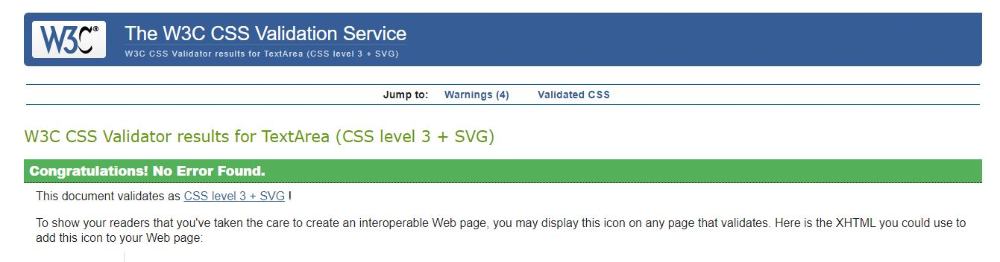
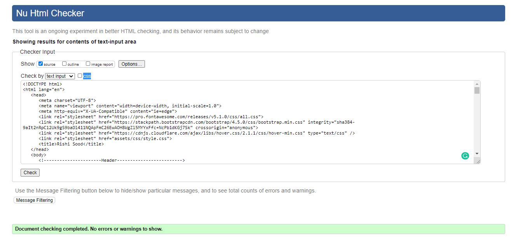

# Milestone Project 1 

[Live Link to project here](https://rishisood1.github.io/Milestone-Project-1/)

This is my first project for Code Institute. The website is a resume allowing future employers to get to know more about me and being able to have a look at my skills and previous work experience. 
The site is made up of 4 pages and has a link in which you can download my CV from for those who are looking for a deeper dive. 

The Home page consists of an introductory paragraph along with a picture of myself and my personal details below. 
The My Skills page shows my education and work history along with the different coding languages I will learn with Code Institute. 
The portfolio page shows all the mini projects I have completed so far. 
Finally, there is a contact page which has a form which allows prospective employers or other web developers to get in touch with me. 

## UX

This project is for potential employers, potential clients, and other web developers to see what my main skills are and allows them to get in touch with me if they want more information or want to collaborate on a project. 

### User Stories 

* As an employer I want to be able to see my previous education, work history and to see if I have the necessary skills. 
* As a potential client I want to be able to view my previous projects 
* As a web developer I want to be able to get in contact to try and collaborate on future projects.
* As a site owner, I would like to increase my online presence so I can become more well known within the web develpoment community. 

### Wireframes

I created my wireframes on Figma. 
I first designed the basic layout of the webpages, once that was done I started adding colours to see how it would look before deciding on my final colour scheme. 

[Figma Wireframes](https://www.figma.com/file/uRnosWmwXzeq2FGx25Ph8z/Milestone-Project-1?node-id=0%3A1)

## Features 

* Feature 1 – Nav Bar – Allows users to easily navigate through the website. Within the navbar there is a Download CV option which when clicked will download my CV for the user to read
* Feature 2 – Contact Form – This page allows users to get in contact with me, form currently doesn’t have a mailto action, so when the submit button is pressed, the website will refresh instead
* Feature 3 – Footer – The footer contains all the links to my social media pages as well as a link download button which allows them to download my CV in a pdf format. 
* Feature 4 – Portfolio Page – This page shows my current projects I have completed with Code Institute. There is a screenshot of the project homepage as well as a short description about the project. When the user clicks on the screenshot, the project will open in a new tab allowing the user to view the website. 
* Feature 5 – Timelines – On the My Skills page there is a timeline which shows the user my education history and work history. The timeline is complete with dates to show the user how long I have been working for as well as how long I have been studying for. 

### Features left to implement

A future feature that I would like to implement would be to add a mailto function so in the future I can receive the content from the contact form when submitted.

### Colours

The pages follow a standard colour scheme with only a few colours being used throughout the whole sight, the colours that were used are listed below:
* #BA55D3 - Purple
* #FFFFFF - White
* #FFFF00 - Yellow
* #C4C4C4 – Light Grey

### Font

Throughout the website, I decided to use 1 font as I thought I would look better than having 2 -3 different fonts. The font I used was Exo as I believed It looked the best out of all the fonts. 

## Technologies Used 

* [HTML5](https://en.wikipedia.org/wiki/HTML5) – HTML was used to create the basic structure of the website.
* [CSS3](https://en.wikipedia.org/wiki/CSS) – I used CSS to style the pages of the website.
* [Google Fonts](https://fonts.google.com/) – Provided me with the font I used throughout the pages.
* [Font Awesome](https://fontawesome.com/) – Was used to add icons on the homepage and the My Skills page. Also used in the footer for the social media links as well as a download icon. 
* [Bootstrap](https://getbootstrap.com/) – I used v4.5 of bootstrap to add columns and rows to the pages to provide some sort of structure. It also allowed me to make the pages responsive  for smaller screen sizes. 
* [jQuery](https://jquery.com/) - The project uses JQuery to simplify DOM manipulation.
* [GitHub](https://github.com/) – I used GitHub to create the repository, it also hosts the website. 
* [Git](https://en.wikipedia.org/wiki/Git) -  Used for version control as well as storing any changes I made to the code. 
* [Gitpod](https://www.gitpod.io/) -  This was the IDE I used for the project
* [Figma](https://www.figma.com/) – Used to create the wireframes which provided me with the basic design of the website. 
* [W3C Markup Validation Service](https://validator.w3.org/) – I used this to validate my HTML to see if there were any errors in my HTML. 
* [W3C CSS Validation Service](https://jigsaw.w3.org/css-validator/) - I used this to validate my CSS to see if there were any errors in my CSS.

## Testing 

* Navbar – The navbar appears at the top of the screen and all the page links are working. When the Download CV link is clicked, my CV appears in a PDF format on a new tab which is expected. The navbar isn’t fixed to the top of the screen so users will have to scroll back to the top of the screen if they want to use the navbar. When the website is viewed on smaller screen sizes, the navbar should turn into a drop-down list which it does. I tested the navbar on different screen sizes and it worked perfectly on every single one. 
* Footer – The Footer appears at the bottom of each page. The social media links are all working, and it leads to my social media pages. There is also another Download CV button. When this is clicked the button is supposed to turn yellow which happens. The CV appears in a pdf format and opens in a new tab. When the website is viewed on smaller screen sizes, the contents of the footer all stack up on each other and is centred. Similar to the navbar, the footer isn’t fixed to the bottom of the screen so the users have to scroll back down to the bottom of the screen to view the footer contents. 
* Portfolio Page – The portfolio page shows all the projects I have completed with Code Institute so far. There is a screenshot of the homepage of each project and a short description of each project. Each of the screenshots are links, so when clicked, it should lead you to the project homepage. To test this, I open the website on different devices and clicked the image. When clicked the project opened in a new tab which is what was expected. 
* Contact Form – To test the contact form, I tried to submit the form without inputting any data in the fields. The result of this was that the form couldn’t be submitted and that error messages appeared saying that data needed to be inputted in the fields. When I did add data into the fields, the form would submit and there wouldn’t be any error messages. 
* Social Media Icons – To test the icons within the footer, I clicked on each icon and it opened the corresponding social media page in a new tab. I tested this on smaller screen sizes to make sure it worked on all  the devices. 

### Testing Stories from UX section 

#### Employer Visitor Goals

* As an employer I want to be able to see my previous education, work history and to see if I have the necessary skills. 

1. When the user opens the website they are taken to the homepage which shows my personal details. 
2. They then can click on the My Skills link in the navbar.
3. This leads them to the My Skills page in which they can find timelines showing my work history and education as well as my cuurent ability in the coding languages I will be learning. 

#### Potential Client Visitor Goals

* As a potential client I want to be able to view my previous projects 

1. When the client opens the website they are taken to the homepage.
2. To view my current portfolio, they can click on the portfolio page in the navbar.
3. Once on the portfolio page they can view my completed projects, they can also view the project by clicking on the picture which will open the project in a new tab.

#### Other Web Developers Visitor Goals

* As a web developer I want to be able to get in contact to try and collaborate on future projects.

1. If another web developer goes on to my website and wants to get in contact with me, they will need to click on the contact link in the navbar. 
2. This will lead them to the contact page which has a contact form on the page.
3. They will need to enter their full name, email address and whatever message they would like. 
4. If the full name and email address fields arent complete then an error message will appear. 

### Testing Tools 

I used the following validation services to validate my code:

* W3C Markup Validation Service 
* W3C CSS Validation Service

Both my CSS and HTML passed the validation service without any errors

<h4 align="center"></h4>
<h4 align="center"></h4>

### Testing Methods 

I used the following devices to test my website on smaller screen sizes:

* Samsung S20
* iPad Pro
* Samsung S10

I then used the developer tools on Google Chrome to test the website on different devices. The devices I tested the site on are as follows:

* iPhone X
* iPad
* Moto G4

## Deployment 

I used GitHub pages to deploy my website. The way I did this is shown below:

1.	I first logged into my GitHub account
2.	I clicked on the Milestone-Project-1 repository and then went onto the settings tab.
3.	I scrolled to the bottom of the page and went to the GitHub pages area
4.	In the GitHub pages section, I changed the branch dropdown list option from none to master.
5.	After this, the page automatically refreshed and the link to the website now appears.

To run the code locally, the following steps need to be undertaken:

1.	In the Milestone-Project-1 repository, click clone or download
2.	A URL will pop up, in which you should copy the URL
3.	Open an IDE of your choice
4.	In the terminal, type in git clone and paste the URL you copied earlier and hit the enter button. 
 

## Credits

### Content 

* The fonts were used from Google Fonts
* The icons were used from the Font Awesome website
* The navbar was used from bootstrap however was first seen in the whiskey drop mini project by Code Institute. 

### Media

* The image on the homepage is one of my own.

### Acknowledgments 

* The inspiration behind this project was based on the resume mini project that I created while completing the User Centric module.
* I received advice from my mentor Aaron Sinnott
* I also received help from the Code Institute Mentoring team who helped me when I had errors which I could not fix myself

